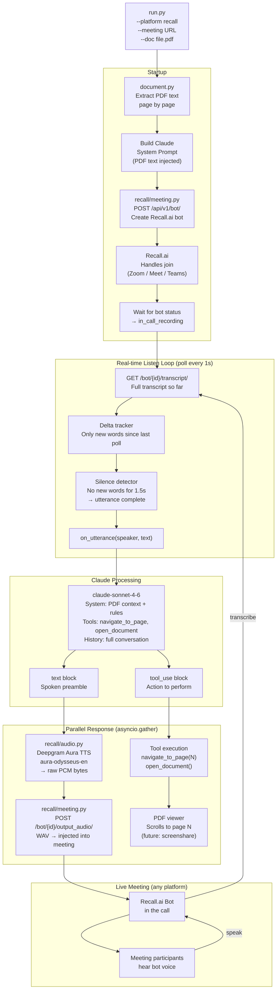
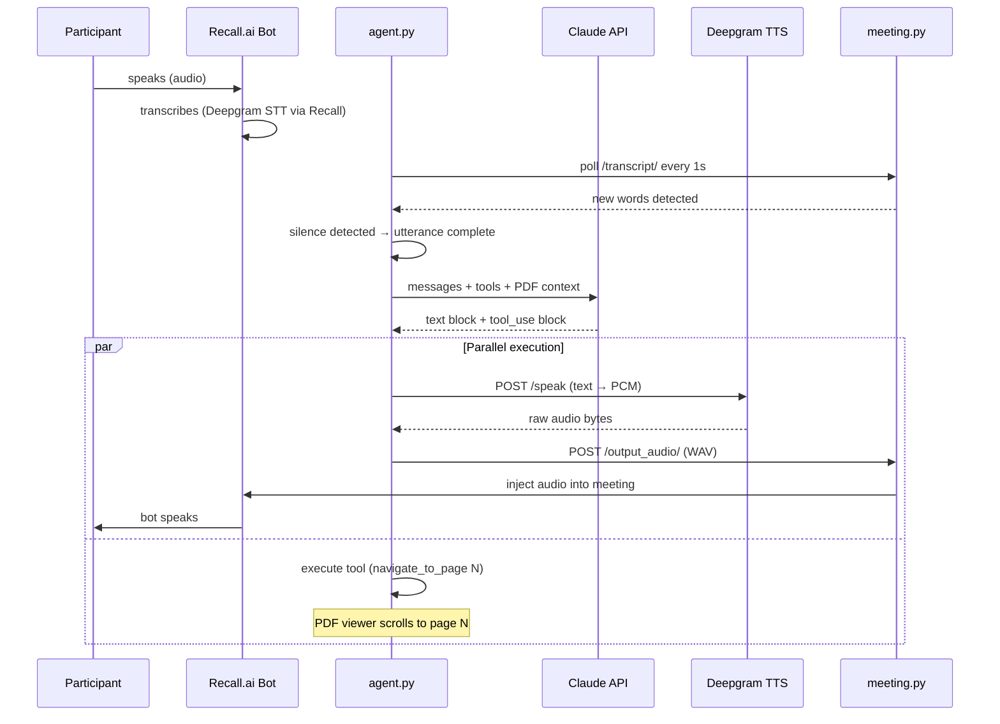
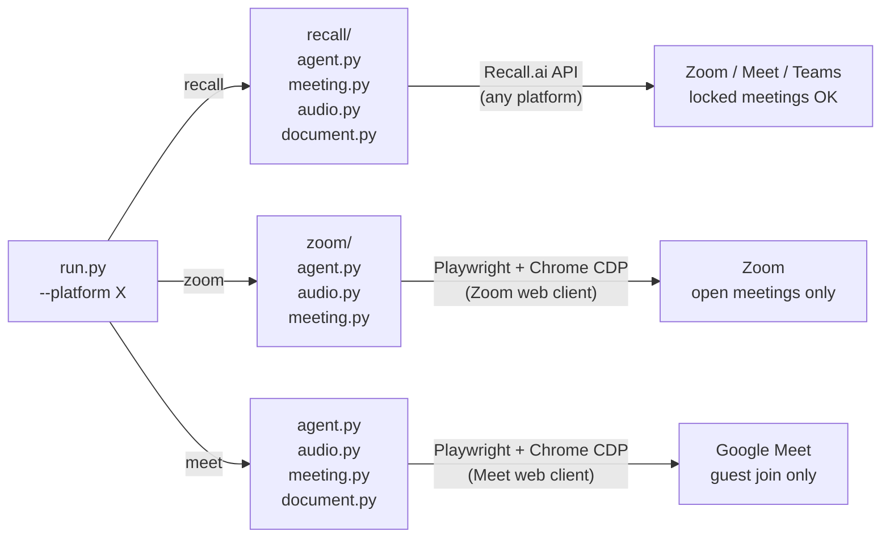
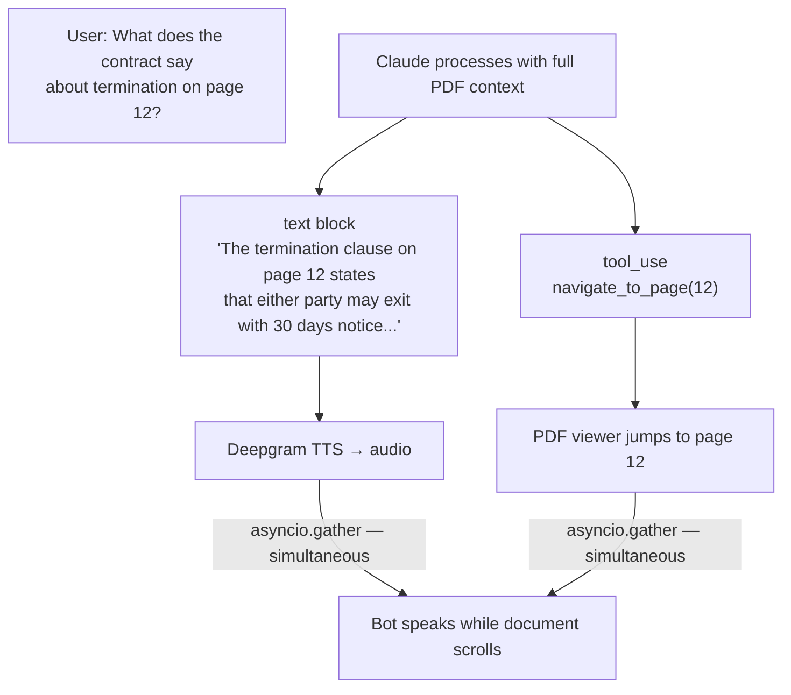

# Meeting AI Agent — Architecture

## System Overview

---

## Conversation Turn — Detailed Sequence

---

## Platform Isolation

---

## External Services

| Service | Purpose | Used in |
|---|---|---|
| **Recall.ai** | Bot joins meeting, STT transcription, audio injection | `recall/` |
| **Anthropic Claude** | Understands question, generates spoken reply + tool calls | all platforms |
| **Deepgram Aura** (TTS) | Converts Claude's text reply to audio (Odysseus voice) | all platforms |
| **Deepgram Nova** (STT) | Transcribes meeting audio | `zoom/`, `meet/` (via PulseAudio) |

---

## Tool Use — How Actions and Speech Sync

