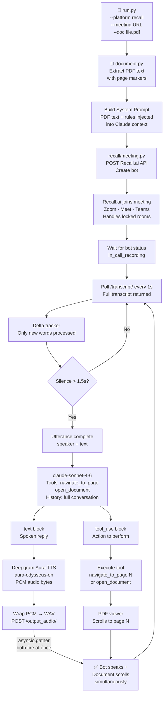
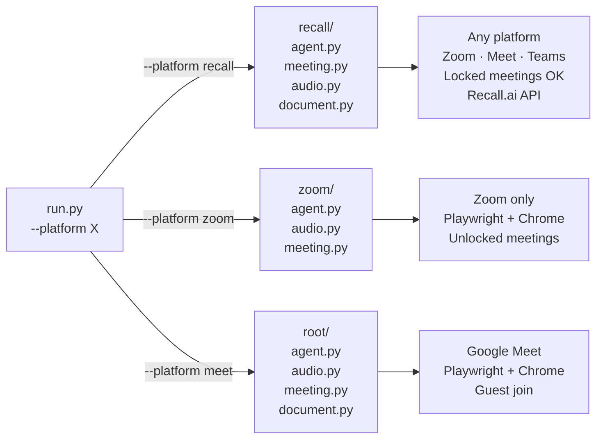
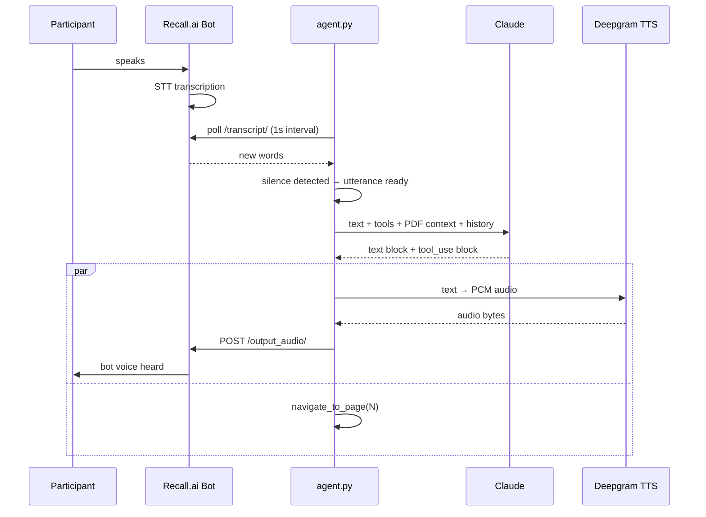

# Meeting AI Agent — Architecture

## Full System Flow

```mermaid
flowchart TD
    CLI["🚀 run.py\n--platform recall\n--meeting URL\n--doc file.pdf"]

    CLI --> DOC["📄 document.py\nExtract PDF text\nwith page markers"]
    DOC --> PROMPT["Build System Prompt\nPDF text + rules injected\ninto Claude context"]
    PROMPT --> CREATE["recall/meeting.py\nPOST Recall.ai API\nCreate bot"]
    CREATE --> JOIN["Recall.ai joins meeting\nZoom · Meet · Teams\nHandles locked rooms"]
    JOIN --> WAIT["Wait for bot status\nin_call_recording"]

    WAIT --> POLL["Poll /transcript/ every 1s\nFull transcript returned"]
    POLL --> DELTA["Delta tracker\nOnly new words processed"]
    DELTA --> SILENCE{"Silence > 1.5s?"}
    SILENCE -->|No| POLL
    SILENCE -->|Yes| UTT["Utterance complete\nspeaker + text"]

    UTT --> CLAUDE["claude-sonnet-4-6\nTools: navigate_to_page\n         open_document\nHistory: full conversation"]

    CLAUDE --> TEXTBLOCK["text block\nSpoken reply"]
    CLAUDE --> TOOLBLOCK["tool_use block\nAction to perform"]

    TEXTBLOCK --> TTS["Deepgram Aura TTS\naura-odysseus-en\nPCM audio bytes"]
    TOOLBLOCK --> TOOLEXEC["Execute tool\nnavigate_to_page N\nor open_document"]

    TTS --> WAVWRAP["Wrap PCM → WAV\nPOST /output_audio/"]
    TOOLEXEC --> PDFNAV["PDF viewer\nScrolls to page N"]

    WAVWRAP -->|asyncio.gather\nboth fire at once| SYNC["✅ Bot speaks +\nDocument scrolls\nsimultaneously"]
    PDFNAV --> SYNC

    SYNC --> POLL
```

---

## Platform Isolation

```mermaid
flowchart LR
    RUN["run.py\n--platform X"]

    RUN -->|"--platform recall"| RC["recall/\nagent.py\nmeeting.py\naudio.py\ndocument.py"]
    RUN -->|"--platform zoom"| ZM["zoom/\nagent.py\naudio.py\nmeeting.py"]
    RUN -->|"--platform meet"| GM["root/\nagent.py\naudio.py\nmeeting.py\ndocument.py"]

    RC --> ANY["Any platform\nZoom · Meet · Teams\nLocked meetings OK\nRecall.ai API"]
    ZM --> ZONLY["Zoom only\nPlaywright + Chrome\nUnlocked meetings"]
    GM --> MONLY["Google Meet\nPlaywright + Chrome\nGuest join"]
```

---

## One Conversation Turn

```mermaid
sequenceDiagram
    participant P as Participant
    participant R as Recall.ai Bot
    participant A as agent.py
    participant C as Claude
    participant D as Deepgram TTS

    P->>R: speaks
    R->>R: STT transcription
    A->>R: poll /transcript/ (1s interval)
    R-->>A: new words
    A->>A: silence detected → utterance ready
    A->>C: text + tools + PDF context + history
    C-->>A: text block + tool_use block
    par
        A->>D: text → PCM audio
        D-->>A: audio bytes
        A->>R: POST /output_audio/
        R->>P: bot voice heard
    and
        A->>A: navigate_to_page(N)
    end
```
