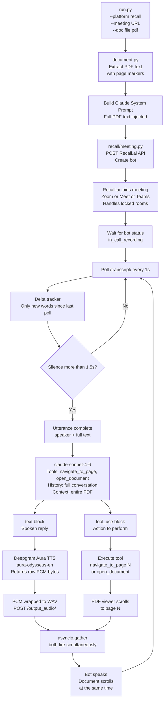
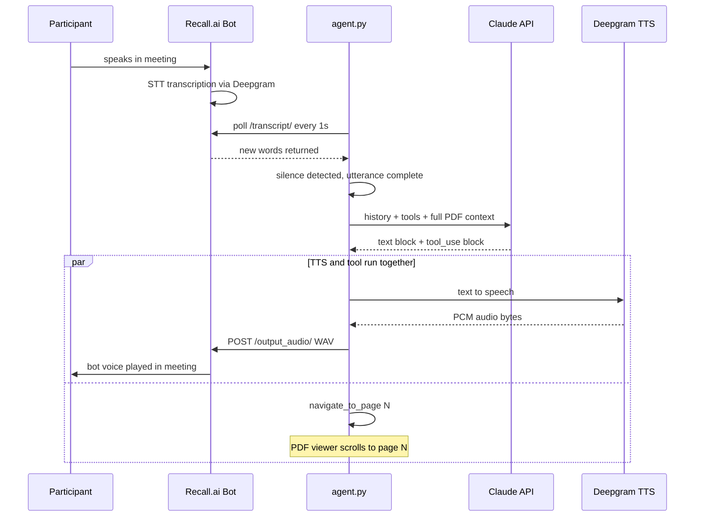
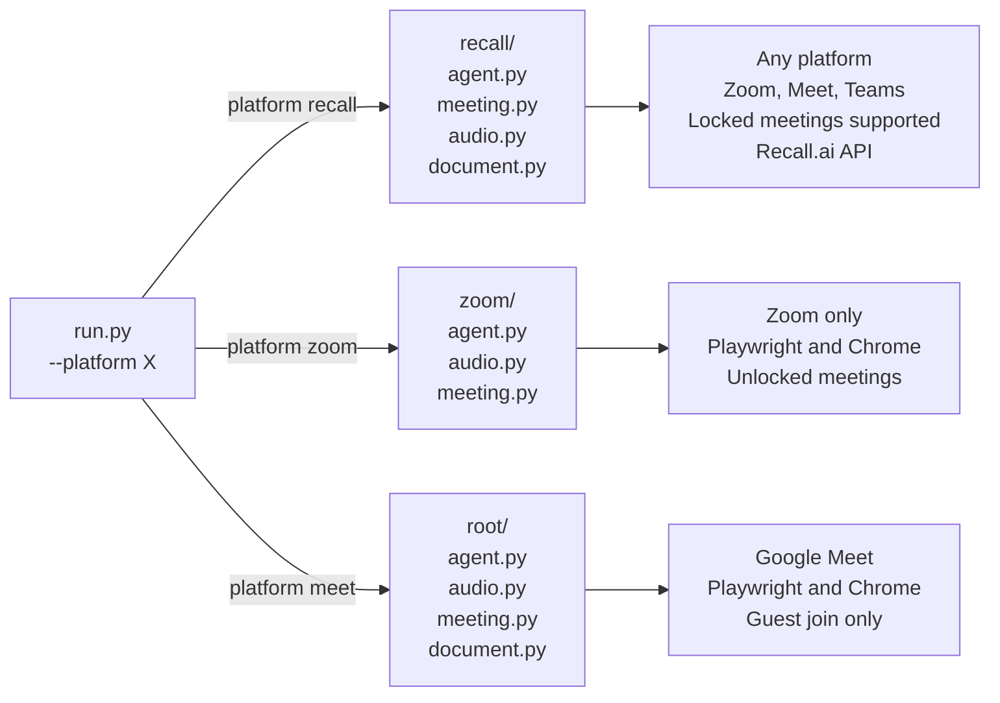

# Meeting AI Agent — Architecture

Paste each block directly into [mermaid.live](https://mermaid.live) — no wrapper needed.

---

## 1. Full System Flow

---

## 2. One Conversation Turn

---

## 3. Platform Isolation

